# Multi-Pipeline CI/CD with Blue/Green Deployments on EKS

This repo contains a sample webapp derived from https://github.com/aws-samples/amazon-eks-cdk-blue-green-cicd.git.  It implements the webapp-pipeline portion of this process:

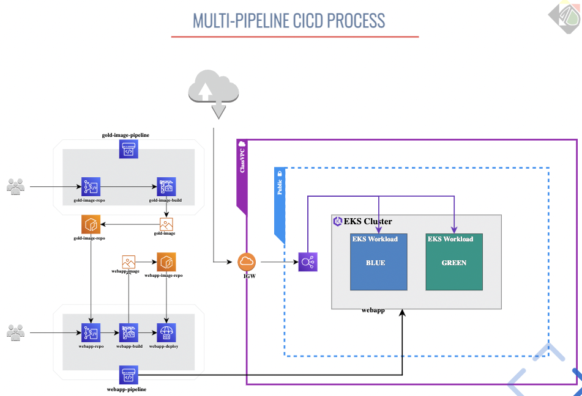

It demonstrates using the blue/green method to deploy application and review the switchover using Application Load Balancer (ALB) Target-groups.

## Set up Cloud9

Pick a region, e.g. 'us-east-1'.

Spin up a Cloud9 in 'us-east-1'. Assign the Cloud9's EC2 instance an AdministratorAccess role, then visit `Cloud9 -> Preferences -> AWS Settings -> Credentials`, and disable the `AWS managed Temporary Credentials`.

### Prepare Your Cloud9 environment

#### Install/configure some utilities, configure aws-cli, and add some AWS environment vars:
```bash
sudo yum install -y jq tree
export ACCOUNT_ID=$(aws sts get-caller-identity --output text --query Account)
export AWS_REGION=$(curl -s 169.254.169.254/latest/dynamic/instance-identity/document | jq -r '.region')
echo "export ACCOUNT_ID=${ACCOUNT_ID}" | tee -a ~/.bash_profile
echo "export AWS_REGION=${AWS_REGION}" | tee -a ~/.bash_profile
aws configure set default.region ${AWS_REGION}
aws configure get default.region
```

#### Install IAM authenticator:
```
curl -o aws-iam-authenticator https://s3.us-west-2.amazonaws.com/amazon-eks/1.21.2/2021-07-05/bin/linux/amd64/aws-iam-authenticator
chmod +x ./aws-iam-authenticator
mkdir -p $HOME/bin && cp ./aws-iam-authenticator $HOME/bin/aws-iam-authenticator && export PATH=$PATH:$HOME/bin
echo 'export PATH=$PATH:$HOME/bin' >> ~/.bashrc
```

#### These CDK pre-reqs should already be there, but if not ...
(Version 1.134.0 for cdk matches the package-lock.json)
```
sudo yum install -y npm
npm install -g aws-cdk@1.134.0 --force
npm install -g typescript@latest
```

#### (And while we're at it, some handy aliases...)
```
cat <<EOF >> ~/.bash_profile

alias a='aws'
alias k='kubectl'
alias addog='git log --all --decorate --oneline --graph --pretty=format:"%C(yellow)%h%Creset%C(cyan)%C(bold)%d%Creset %C(cyan)%cd%Creset %s" --date=format:"%y-%m%d-%H%M"'
alias adog='git log --all --decorate --oneline --graph'
alias ga='git add'
alias gb='git branch'
alias gc='git commit'
alias gco='git checkout'
alias gcom='git checkout main'
alias gd='git diff'
alias gds='git diff --staged'
alias gl='git config -l'
alias gr='git remote -v'
alias gril='grep --color=auto -ril --exclude-dir=vendor --exclude-dir=.git --exclude-dir=node_modules --exclude-dir=venv --exclude-dir=_site'
alias gs='git status'
alias h='git rev-parse HEAD'
alias grep='grep --color=auto'
alias l.='ls -d .* --color=auto'
alias ll='ls -l --color=auto'
alias ls='ls --color=auto'
set -o vi
EOF
```

#### Git clone our repository
```
cd ~/environment
git clone https://github.com/lawromwal/source-for-blue-green-webapp
```

### CDK Launch
The infrastructure is spawned using AWS Cloud Development Kit (CDK), enabling you to reproduce the environment when needed, in relatively fewer lines of code.

```
# Create a new cdk project
cd ~/environment/source-for-blue-green-webapp/cdk
cdk init

# Install the required modules from package.json
npm install

# Compile the packages to Javascript
npm run build

# List the empty stack; should see "CdkStackEksALBBg"
cdk ls

# Emit the CDK-originated CloudFormation template to STDOUT...
cdk synth


# Bootstrap the CDKToolkit CloudFormation stack into your environment

# Deploying AWS CDK apps into an AWS environment (a combination of an AWS account and region) requires that you provision resources the AWS CDK needs to perform the deployment. These resources include an Amazon S3 bucket for storing files and IAM roles that grant permissions needed to perform deployments. The process of provisioning these initial resources is called bootstrapping.

# The required resources are defined in a AWS CloudFormation stack, called the bootstrap stack, which is usually named CDKToolkit. Like any AWS CloudFormation stack, it appears in the AWS CloudFormation console once it has been deployed.

cdk bootstrap aws://$ACCOUNT_ID/$AWS_REGION --force

# Launch the CloudFormation stack created in the earlier steps.
# You may be asked to confirm the creation of the roles and authorization
# before the CloudFormation is executed, for which, you can respond with a “Y”.
cdk deploy

# An S3 bucket prefixed with "cdktoolkit-stagingbucket-" is created for that region.
```

### Populate the application's source code repo
Because the CdkStackEksALBBg-repo repository is empty, the CodePipeline will show a failure in the Source CodeCommit repository stage.

Push your local application to the newly created CodeCommit Repository: CdkStackEksALBBg-repo.
```
git remote add codecommit https://git-codecommit.$AWS_REGION.amazonaws.com/v1/repos/CdkStackALBEksBg-repo
git push -u codecommit main
```

The infrastructure will take some time to be created, please wait until you see the Output of CloudFormation printed on the terminal. Until then, take time to review the CDK code in the below file: cdk/lib/cdk-stack.ts

You may also check and compare the CloudFormation Template created from this CDK stack:
cdk/cdk.out/CdkStackEksALBBg.template.json


The hosting infrastructure consists of pods hosted on Blue and Green service on Kubernetes Worker Nodes, being accessed via an Application LoadBalancer. The Blue service represents the production environment accessed using the ALB DNS with http query (group=blue) whereas Green service represents a pre-production / test environment that is accessed using a different http query (group=green). The CodePipeline build stage uses CodeBuild to dockerize the application and post the images to Amazon ECR. In subsequent stages, the image is picked up and deployed on the Green service of the EKS. The Codepipeline workflow is then blocked at the approval stage, allowing the application in Green service to be tested. Once the application is confirmed to be working fine, the user can issue an approval at the Approval Stage and the application is then deployed on to the Blue Service.

The Blue/Green architecture diagrams are provided below:

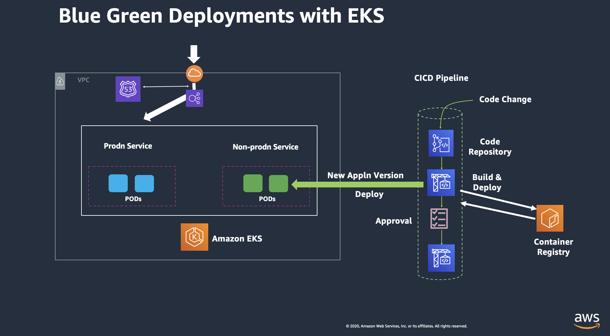
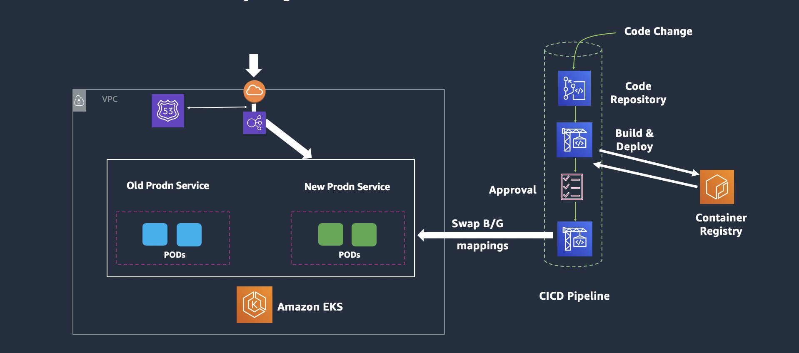

The CodePipeline would look like the below figure:

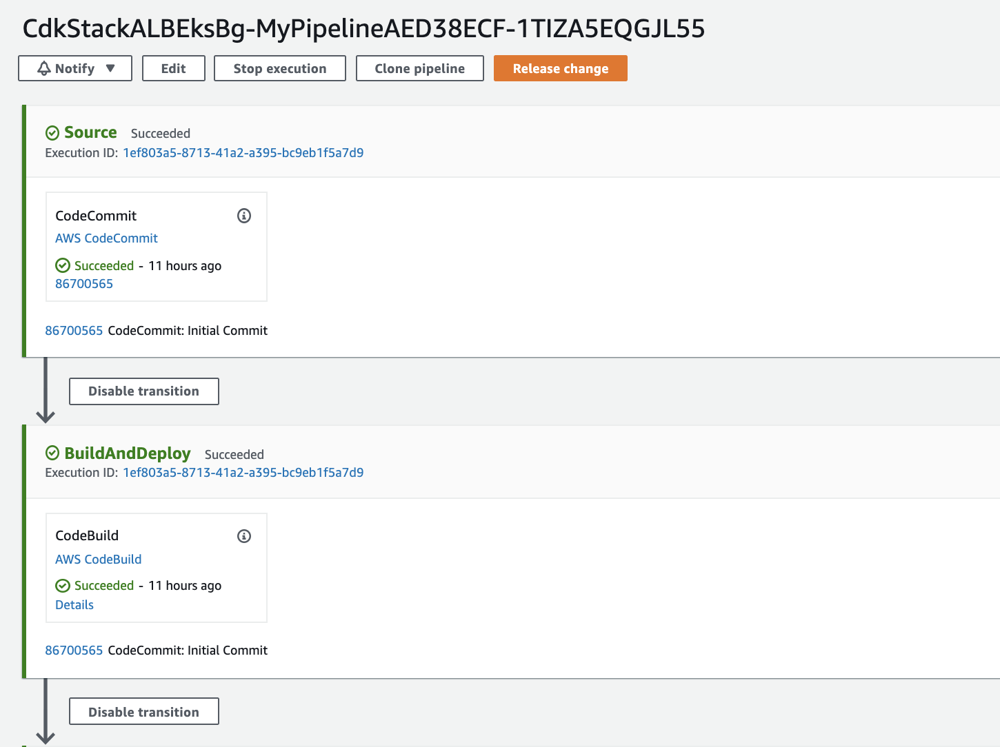
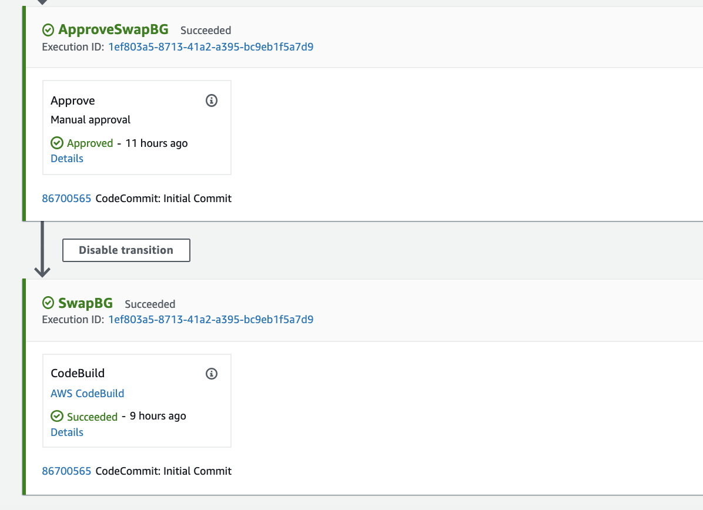

The current workshop is based upon this link and the CDK here is extended further to incorporate CodePipeline, Blue/Green Deployment on EKS with ALB.

NOTE: CodeDeploy does not currently support deploying on EKS.  So instead, we use CodeBuild to run the deploy of the Containers on Pods, spawn the EKS Ingress controller, and spawn the Ingress resource in the form of an Application Load Balancer (ALB).

NOTE: If using the latest CDK version using "npm install -g aws-cdk" (without a version specification), the EKS construct must be modified to include version number too.

#### Configure EKS environment

Once the cdk is deployed successfully...

1. Go to the CloudFormation Service,
1. Select the CdkStackALBEksBg stack,
1. Go to the **outputs** section, and 
1. Copy the value from the field "ClusterConfigCommand".  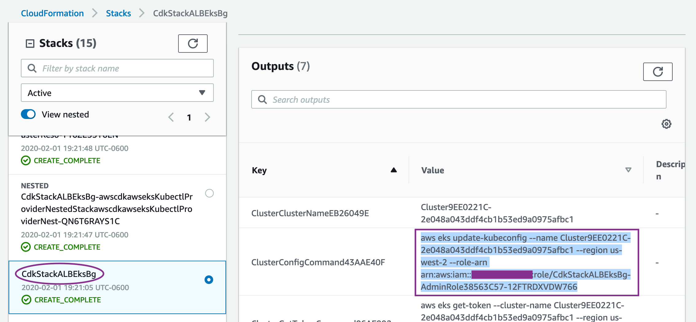
1. Then, paste this output into Cloud9 terminal to configure the EKS context.
1. Ensure you can see 2 nodes listed in the output of :
```bash
kubectl get nodes
```
1. Now, configure the EKS cluster with the deployment, service and ingress resource as ALB using following set of commands:
```bash
cd ../flask-docker-app/k8s
chmod +x create-eks-blue-green-infra-with-kubectl.sh
INSTANCE_ROLE=$(aws cloudformation describe-stack-resources --stack-name CdkStackALBEksBg | jq .StackResources[].PhysicalResourceId | grep CdkStackALBEksBg-ClusterNodegroupDefaultCapacityNo | tr -d '["\r\n]')
CLUSTER_NAME=$(aws cloudformation describe-stack-resources --stack-name CdkStackALBEksBg | jq '.StackResources[] | select(.ResourceType=="Custom::AWSCDK-EKS-Cluster").PhysicalResourceId' | tr -d '["\r\n]')
echo "INSTANCE_ROLE = " $INSTANCE_ROLE 
echo "CLUSTER_NAME = " $CLUSTER_NAME
```

Note: Before proceeding further, confirm to see that both the variables $INSTANCE_ROLE and $CLUSTER_NAME have values populated.  If they are not, you may collect the Clustername from the CloudFormation Output and the Worker node instance role from the EC2 dashboard.

(After EKS version 1.16 onwards, the k8 deploy API's using apps/v1beta1 is deprecated to apps/v1. The update has been made into the yaml files, however, if you are using an older version of EKS, you may need to change this back).

```bash
# $AWS_REGION $INSTANCE_ROLE $CLUSTER_NAME
./create-eks-blue-green-infra-with-kubectl.sh 
```

### STOPPED HERE - BELOW is to-be-updated

### Modify the ALB Security Group

Modify the Security Group (ControlPlaneSecurityGroup) for the newly spawned Application Load Balancer to add an incoming rule to allow http port 80 for the 0.0.0.0/0.
Services -> EC2 -> Load Balancer -> Select the latest created ALB -> Click Description Tab -> Scroll down to locate the Security Group Edit this security group to add a new rule with following parameters: http, 80, 0.0.0.0/0

Additionally, from EKS version 1.17 onwards, you would also need to change the security-group for Worker Nodes Data Plane (InstanceSecurityGroup) by adding an incoming rule to allow http port 80 for the ControlPlaneSecurityGroup (ALB).

Now, check the newly created LoadBalancer and review the listener routing rules: Services -> EC2 -> Load Balancer -> Select the latest created ALB -> Click Listeners Tab -> View/Edit Rules You would see the below settings shown:

Check the Load Balancer Target-groups and ensure the healthy hosts have registered and health check is consistently passing as shown below:

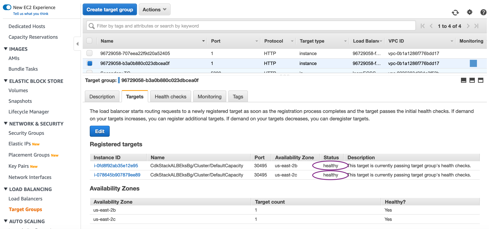

Check the healthy hosts count graph to ensure the hosts, containers are stable:

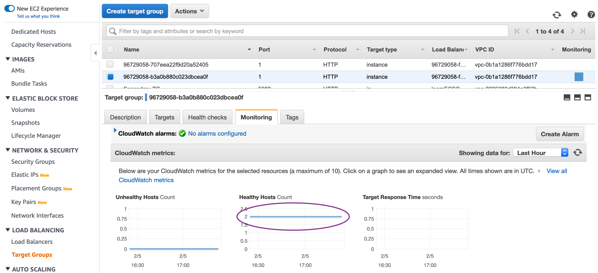

<b> Step4: Upload the Application to CodeCommit repo:</b>

Now that the ALB is setup, complete the last part of the configuration by uploading the code to CodeCommit repository:

```bash
cd ../..
pwd => confirm your current directory is amazon-eks-cicd-codebuild-eks-alb-bg
git add flask-docker-app/k8s/alb-ingress-controller.yaml
git add flask-docker-app/k8s/flaskALBIngress_query.yaml
git add flask-docker-app/k8s/iam-policy.json
git commit -m "Updated files"
git remote add codecommit https://git-codecommit.$AWS_REGION.amazonaws.com/v1/repos/CdkStackALBEksBg-repo
git push -u codecommit master
```

This will push the last commit we carried out in our preparation section, which in turn will trigger the CodePipeline.

### Review the Infrastructure:

Collect the DNS Name from the Load Balancer and access the homepage:

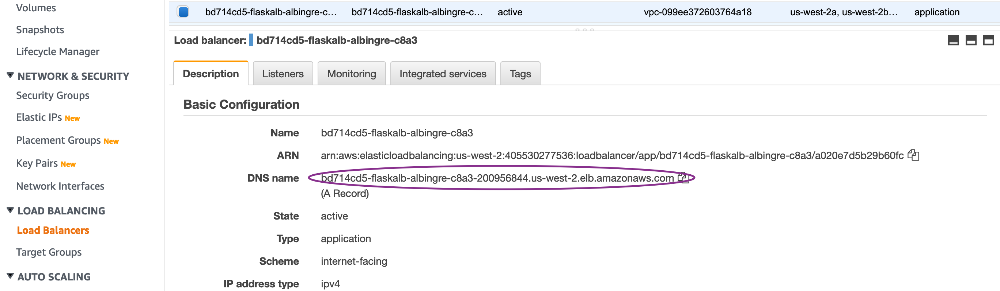

Once the Application is pushed to the Repository, the CodePipeline will be triggered and CodeBuild will run the set of commands to dockerize the application and push it to the Amazon ECR repository. CodeBuild will in turn run the kubectl commands to create the Blue and Green services on the EKS clusters, if it does not exist. For the first time, it will pull the Flask demo Application from the Dockerhub and deploy it on Blue as well as Green service. It should say "Your Flask application is now running on a container in Amazon Web Services" as shown below:

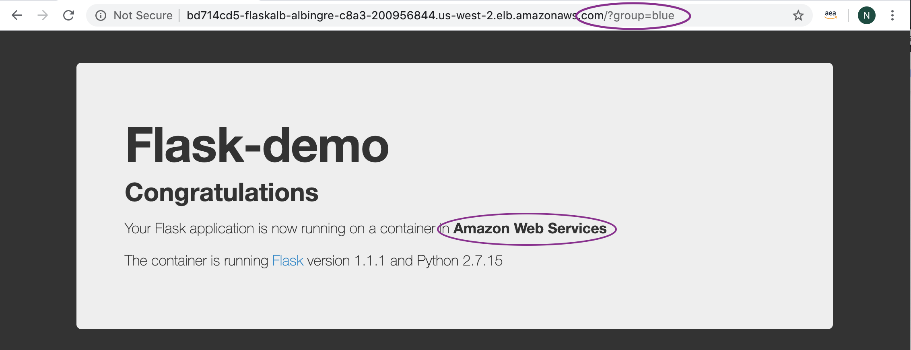
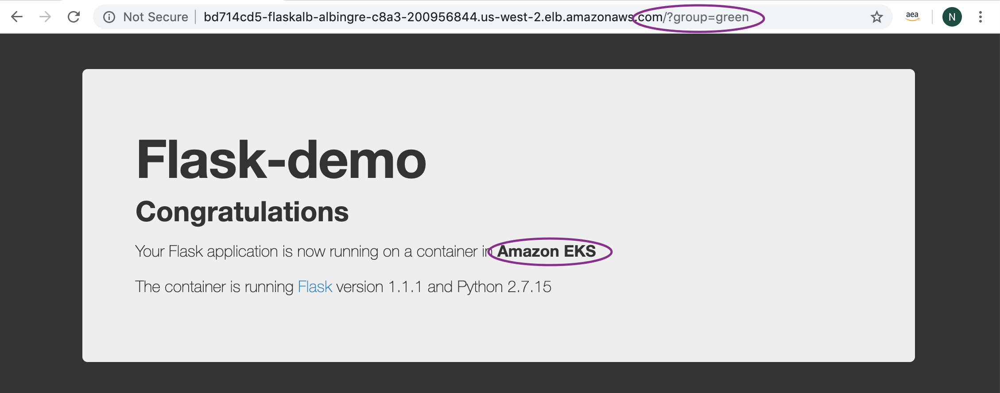


Go to Services -> CodePipeline -> Pipelines -> CdkStackEksALBBg-[unique-string]
Review the Stages and the CodeBuild Projects to understand the implementation.
Once the Application is deployed on the Green service, access it as mentioned above: http://ALB-DNS-name/?group=green.

It is important to note that container exposes port 5000, whereas service exposes port 80 (for blue-service) OR 8080 (for green-service) which in turn is mapped to local host port on the EC2 worker node instance.

After testing is completed, go to the Approval Stage and Click Approve. This will trigger the CodePipeline to execute the next stage to run the "Swap and Deploy" stage where it swaps the mapping of target-group to the blue / green service.


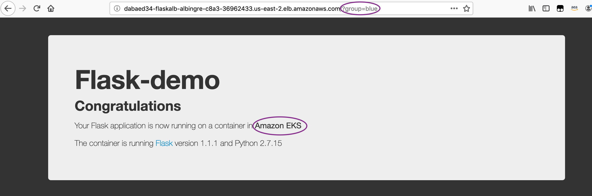
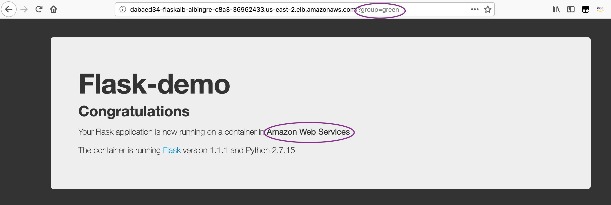


### Cleanup

(a) Remove the EKS Services:
First connect to the kubernetes cluster using command published as "ConfigCommand" under CloudFormation output. Run "kubectl get svc" to check if you can see the Blue and Green services. Then run the below commands to delete the services.

```bash
kubectl delete svc/flask-svc-alb-blue svc/flask-svc-alb-green -n flask-alb
kubectl delete deploy/flask-deploy-alb-blue deploy/flask-deploy-alb-green -n flask-alb
kubectl delete ingress alb-ingress -n flask-alb
kubectl delete deploy alb-ingress-controller -n kube-system
```

(b) Destroy the CDK Stack:
Ensure you are in the cdk directory and then run the below command:

```bash
cdk destroy
```

(c ) Remove the individual created policies:
Access IAM Service, then access Roles, then select the Worker Node Instance role (search by CdkStackALBEksBg-ClusterDefaultCapacityInstanceRol) and then remove the inline elb-policy
Access IAM Service, then access Policies, then select “alb-ingress-controller” managed policy created for kubectl, then Select Policy Actions and Delete

### Conclusion:

We built the CICD Pipeline using CDK to containerize and deploy a Python Flask based application using the Blue/Green Deployment method on Amazon EKS. We made the code change and saw it propagated through the CICD pipeline and deploy on Blue/Green service of EKS.
